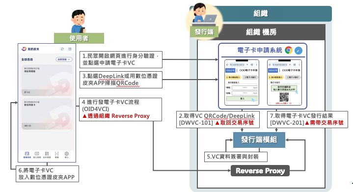
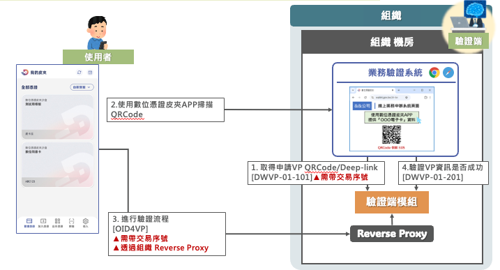
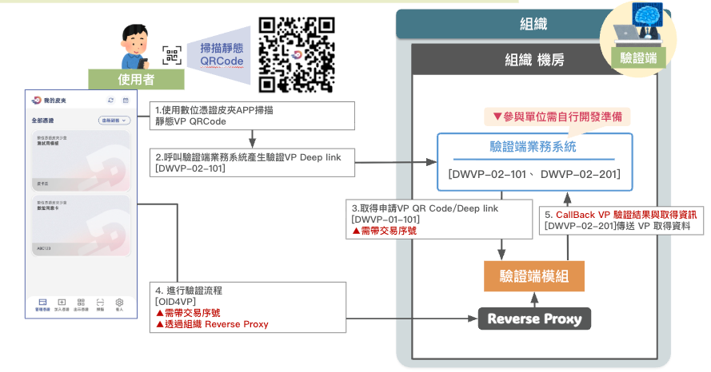
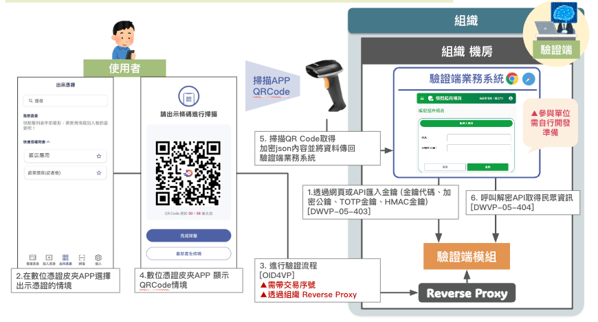
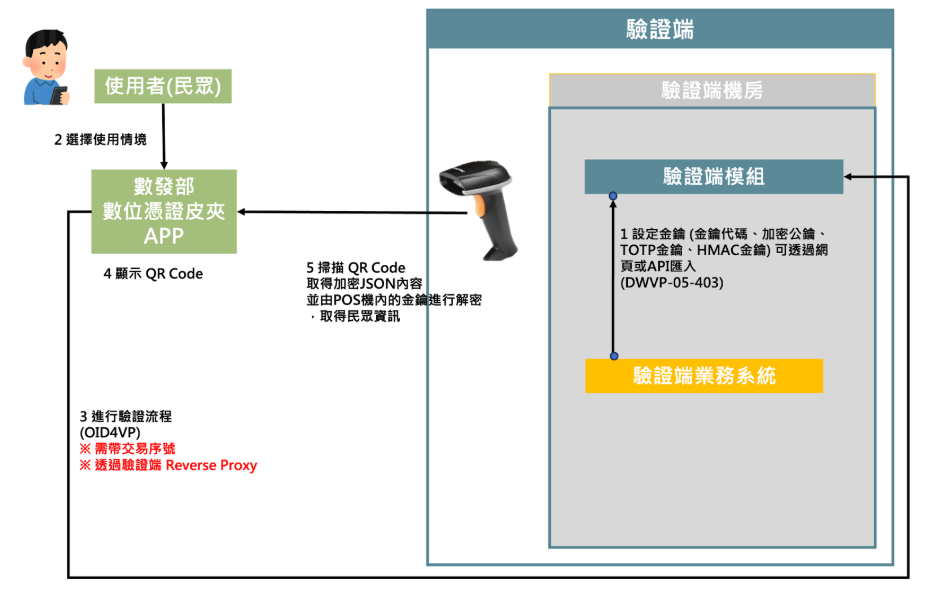

# 數位憑證皮夾系統API介接規格資料

最新版本：1.0  
數位憑證皮夾建置團隊： [service@wallet.gov.tw](mailto:service@wallet.gov.tw)  
最後修訂日期 : 2025/10/16

| 文件版本 | 修訂日期 | 修訂內容 |
| :---- | :---- | :---- |
| 1.0 | 2025/10/16 | 初版 |

## 目錄

- [壹、目的](#purpose)
- [貳、概述](#overview)
- [參、Access-Token說明](#access-token)
- [肆、名詞說明](#terminology)
  - [一、VC介紹](#overview-vc)
  - [二、VP介紹](#overview-vp)
  - [三、發行端（Issuer）](#overview-issuer)
  - [四、持有端APP（數位憑證皮夾APP）](#overview-holder)
  - [五、驗證端（Verifier）](#verifier)
- [伍、發行端系統流程與API說明](#issuer-apis)
  - [一、發行端發行電子卡流程](#issuer-flow)
  - [二、發行端模組API規格說明](#issuer-module-spec)
- [陸、驗證端系統流程與API說明](#verifier-apis)
  - [一、驗證端模組API規格說明](#verifier-module-spec)
  - [二、DWVP-01 由驗證端出示QRCode之情境流程](#dwvp-01-overview)
  - [三、DWVP-02：由手機端掃描靜態QRCode之情境流程](#dwvp-02-overview)
  - [四、DWVP-05：由數位憑證皮夾APP出示QR Code之情境流程](#dwvp-05-overview)

<a id="purpose"></a>
## 壹、目的

本文件旨在提供各中央與地方機關、公共服務業者及合作廠商於導入「數位憑證皮夾」生態系時所需的完整技術依據。透過統一的 API 介接規格，協助發行端、持有端與驗證端之間，以符合 OID4VCI 與 OID4VP 國際標準的方式安全交換 Verifiable Credential（VC）與 Verifiable Presentation（VP）。同時，本文件亦定義存取控制、交易追蹤與異常處理機制，確保跨單位整合時的安全性、可追溯性與法規遵循，支持政府及民間單位快速上線對應服務。

<a id="overview"></a>
## 貳、概述

本規格文件涵蓋數位憑證皮夾系統的整體架構、參與角色與作業流程說明，並逐一說明 Access Token 管理、服務端模組功能及環境端點。內容依序介紹發行端與驗證端模組的互動流程圖、API 端點（DWVC 系列與 DWVP 系列）、請求／回應格式範例、錯誤代碼與回呼設定，以指引開發團隊實作發卡、查詢、狀態管理與驗證情境。透過沙盒、測試與正式環境的劃分，以及圖文並陳的步驟說明，本文件協助介接單位在實作前掌握整體作業脈絡，縮短整合時程並提升介接品質。

<a id="access-token"></a>
## 參、Access-Token說明

管理者登入發行/驗證端後台後，建立一個屬於「AP 類型」的使用者帳號，並指派其具備「issuer_org_apuser 或 verifier_org_apuser」之系統呼叫端角色權限。當該使用者帳號建立並啟用後，系統將透過啟用帳號通知信提供相關的 API 介接資訊，其中包含可用於系統對接之 Access Token。

<a id="terminology"></a>
## 肆、名詞說明

以下是針對 OID4VCI（OpenID for Verifiable Credential Issuance）與 OID4VP（OpenID for Verifiable Presentation）協定中各參與者角色的完整說明與舉例。

<a id="overview-vc"></a>
### 一、VC介紹

Verifiable Credential（VC）是以 W3C 標準為基礎的數位憑證格式，透過加密簽章保證內容完整性與發行端可驗證性。每一張 VC 都包含憑證主體（Subject）的屬性資料（Claims），例如姓名、證號、資格狀態等，以及發行端的去中心化識別碼（DID）、有效期間與撤銷資訊。發行端模組在完成資料審核後會生成 VC，並以 JSON-LD 格式封裝，附帶 JWS/JWT 或 JSON-LD Signatures 等簽章機制，確保憑證在跨系統傳遞時不被竄改。VC 可儲存在數位憑證皮夾APP或其他兼容的 Holder 端產品中，並支援選擇性揭露（Selective Disclosure）與多重憑證並存。當 VC 被撤銷或更新時，發行端亦會同步至狀態清冊（Status List），讓驗證端能即時查核憑證是否仍有效。

實際案例包括：交通部公路局發放「駕照電子卡」VC，民眾完成身份查核後即可在皮夾中收到具有法規效力的數位駕照；教育機構核發「學生證電子卡」VC用於校園門禁與線上學務系統登入；電信公司提供「門號電子卡」 VC，協助民眾在進行超商領貨時，進行資格的確認。這些 VC 在皮夾中以卡片形式呈現，民眾可依不同生活情境選擇使用。
  
  ---

<a id="overview-vp"></a>
### 二、VP介紹

Verifiable Presentation（VP）是由持有端（Holder）基於一張或多張 VC 所組合而成的展示資料，用以回應驗證端的資訊請求。VP 透過 OID4VP 標準流程建立，持有端將被要求提供的 VC 欄位重組後，再次加上持有端的簽章與時戳，確保傳輸過程中資料未被截取或重播。驗證端檢查 VP 時，會同時驗證三層安全性：持有端簽章、所引用 VC 的發行端簽章、以及 VC 在狀態清冊中的有效狀態。VP 支援動態選擇性揭露與雙向驗證，可透過 QR Code、Deep Link 或回呼端點進行交換，適合應用於臨櫃、線上服務及自助機台等多種場景。

舉例而言，租車業者出示 QR Code 後，民眾可僅揭露駕照 VC 中必要欄位組成 VP 完成資格核驗；且可透過 Deep Link 讓民眾於手機端直接啟動數位憑證皮夾APP進行自主揭露，並進行簽章與狀態檢查，以提升 KYC 成功率並降低風險。
  
  ---

<a id="overview-issuer"></a>
### 三、發行端（Issuer）

   1. 發行端電子卡申請系統（Issuer Business System）  
      （1）**說明：** 發行單位既有之內部業務系統，負責管理申請人資料、審查簽發資格，並支援電子卡申請、資料維護與核發流程。  
      （2）**舉例：**  
         * 交通部公路局駕照系統：執行駕照電子卡申請與核發作業。  
         * 經濟部商發署工商憑證系統：處理工商憑證電子卡申請與核發流程。  

   2. 發行端模組（Issuer Module）  
      （1）**說明：** 由**數位發展部**提供並部署於發行端伺服器環境之模組，實作 OID4VCI 規範，協助簽發數位憑證至持有者的數位憑證皮夾。  
      （2）**核心功能：**  
         * 處理 VC 建立、簽章與發送流程  
         * 提供與 App 的互動式授權與交換機制
   
   3. **運作示例：**  
      公路局駕照系統透過「發行端模組」提供之 API，完成駕照電子卡的簽發，並將憑證傳送至民眾的數位憑證皮夾APP。

  ---

<a id="overview-holder"></a>
### 四、持有端APP（數位憑證皮夾APP）
   1. **說明：** 數位憑證皮夾為民眾端行動應用程式，提供接收、儲存與管理 Verifiable Credentials（VC/電子卡），並支援依需求組合與揭露 Verifiable Presentation（VP）。  
   2. **下載方式：** 可分別透過 **Google Play** 與 **Apple App Store** 下載安裝。

      

   3. **核心功能：**  
      * 集中保管來自不同發行端的 VC 並維持其完整性  
      * 以視覺化介面呈現憑證內容與狀態  
      * 主動向驗證端發送 VP（Verifiable Presentation）以回應驗證需求  
      * 支援選擇性揭露、通訊加密與權限授權管理

  4. **應用示例：** 
      * 民眾可將交通部公路局簽發之駕照電子卡等多種憑證儲存在 App 中統一管理。  
      * 租車櫃台驗證時，持有人可透過 App 選擇性揭露必要資料，提供給租車業者完成身分核驗。

  ---

<a id="verifier"></a>
### 五、驗證端（Verifier）

   1. 驗證端業務系統（Verifier Business System）  
      (1) **說明：** 驗證端業務系統為各單位執行憑證驗證作業之核心平台，由驗證單位自行開發，可呼叫驗證端模組完成VP之驗證作業，並依據業務需求（例如 KYC 身分核驗、資格審查）判斷是否放行或執行後續流程。  
      (2) **應用情境：**  
         * 超商於門市透過電信門號電子卡完成驗證流程。  
         * 租車平台於線上服務流程中確認客戶駕照有效性與資格。

   2. 驗證端模組（Verifier Module）  
      (1) **說明：** 驗證端模組由數位發展部提供，並部署於驗證端之伺服器環境，實作 OID4VP 標準 API，協助業務系統向持有端發出 VP 請求並完成驗證作業。  
      (2) **核心功能：**  
         * 向 App 發送 VP 請求，並支援指定選擇性揭露欄位。  
         * 驗證憑證簽章、發證端DID有效性，確保資料完整性。  
   3. **運作示例：**  
      * 租車業者於受理租車申請時，透過業務系統呼叫驗證端模組發出 VP 請求；持有端 App 回傳簽章完成的 VP 後，業者即可審核駕照有效性並保留稽核紀錄。

<a id="issuer-apis"></a>
## 伍、發行端系統流程與API說明

<a id="issuer-flow"></a>
### 一、發行端發行電子卡流程
      
   

流程順序說明

| 項次 | 說明 | 對應的API | 備註 |
| :---: | ----- | ----- | ----- |
| 1 | 開啟網頁，點選申請電子卡VC |  |  |
| 2 | 呼叫API，傳遞使用者資料，並取得申請VC QR Code/DeepLink | DWVC-101 | 取回交易序號 |
| 3 | 點選DeepLink或用數位憑證皮夾APP掃描QR Code |  |  |
| 4 | 進行發電子卡VC流程(OID4VCI) |  | 透過組織端 Reverse Proxy |
| 5 | VC資料簽署與封裝 |  |  |
| 6 | 將電子卡VC放入數位憑證皮夾APP |  |  |
| 7 | 取得電子卡VC發行結果 | DWVC-201 | 需帶交易序號 |

<a id="issuer-module-spec"></a>
### 二、發行端模組API規格說明

發行端模組網址：

1. 於沙盒階段(不可用於正式環境)，網址為：[https://issuer-sandbox.wallet.gov.tw/](https://issuer-sandbox.wallet.gov.tw/)  
2. 測試環境，網址為各參與單位的內部主機位置  
3. 正式環境，網址為各參與單位的內部主機位置

<a id="dwvc-101"></a>
### 1. DWVC-101-發行端模組產生QR Code

本 API 由發行端業務系統呼叫，用於依據既有的 VC 模板產生一組可供民眾掃描的申辦 QR Code／Deep Link。成功呼叫後會取得 `transactionId`（後續查詢用）、`qrCode`（可直接呈現在頁面）與 `deepLink`（可觸發皮夾 App），並可同時指定待撤銷的舊卡片清單。請先於發行端模組完成 VC 範本設定，再依需求填寫欄位資料。

#### (1) 基本資訊

| 編號 | DWVC-101 |
| ---- | ----- |
| 名稱 | 發行端模組產生QR Code |
| URL | \<發行端模組網址\>/api/qrcode/data |
| 呼叫方向 | 發行端業務系統 \=\> 發行端模組 |
| 傳輸方式 | POST |

#### (2) Header資訊

| 參數名稱 | 參數值 |
| ---- | ----- |
| Content-Type | application/json |
| Access-Token | 系統API權杖 |

#### (3) Request 傳輸內容

| 參數名稱 (*必填) | 參數說明 |
| ---- | ----- |
| *vcUid | VC 模板代碼。可於發行端模組「VC 管理 \> VC 建立管理」的詳細資料頁面取得「證件類型」欄位值。 |
| issuanceDate | 卡片發行日（YYYYMMDD）。例：`20250413`。 |
| expiredDate | 卡片到期日（YYYYMMDD）。例：`20250513`。 |
| dataTag | 自行定義的資料標註（例如來源資料的雜湊值），可搭配 DWVC-202/203 查詢。 |
| *fields | 欄位內容陣列，每筆需包含 `ename`（在 VC 模板中設定的 Key）與 `content`（實際值）。 |
| cids | 欲同時撤銷的舊卡片 `cid` 清單，可參考 DWVC-201 回傳的 `jti` 解析取得。 |

**Request 範例**

```json
{
  "vcUid": "00000000_vpms_20250506_1217",
  "issuanceDate": "20250413",
  "expiredDate": "20250513",
  "dataTag": "8e4fad461737cd9fb7fdaf9cfff075d080cc86c",
  "fields": [
    {
      "ename": "name",
      "content": "王O明"
    },
    {
      "ename": "company",
      "content": "MODA數位發展部"
    },
    {
      "ename": "email",
      "content": "service@wallet.gov.tw"
    }
  ],
  "cids": [
    "5840b974-bb4b-42c5-9ebe-84424cf0d890",
    "0c82936e-9f36-427e-be3f-439e03f4d75a"
  ]
}
```

#### (4) Response 傳輸內容

| 回傳值名稱 | 回傳值說明 |
| ---- | ----- |
| transactionId | 本次請求的唯一交易序號，後續查詢發卡結果時必須使用。 |
| qrCode | 可直接呈現在網頁的 QR Code 圖片（Base64）。 |
| deepLink | 可啟動數位憑證皮夾APP 的 Deep Link。 |
| warnings | 欲撤銷卡片的處理結果，若有無法處理的 `cid` 會列在子欄位中。 |
| warnings.statusRevoke | 已經是撤銷狀態的卡片清單。 |
| warnings.cidNotFound | 系統內不存在的卡片清單。 |

**HTTP Status = 201 範例**

```json
{
  "transactionId": "be08beaa-d5f8-4a27-ac44-7ac7cad8b9eb",
  "qrCode": "data:image/png;base64,...",
  "deepLink": "modadigitalwallet://credential_offer?...",
  "warnings": {
    "statusRevoke": [
      "1abc7fdf-88d7-4471-9b69-2efa8c028adf"
    ],
    "cidNotFound": [
      "4f966533-d467-4063-a2a5-e9045175131e",
      "c6c55a1a-3a67-462b-af22-a25c7b58c8cc"
    ]
  }
}
```

**HTTP Status = 4xx 範例**

```json
{
  "code": "11001",
  "message": "缺少參數或參數不合法"
}
```

#### (5) HTTP Status 狀態說明

| Status Code | Status Code描述 |
| ---- | ----- |
| 201 | 請求成功 |
| 4xx | 請求參數錯誤，請參考錯誤代碼說明 |
| 500 | 伺服器內部錯誤，請聯絡客服人員處理 |

#### (6) HTTP Status 4xx 代碼表

| code | message |
| ---- | ----- |
| 11001 | 缺少參數或參數不合法 |
| 11002 | 使用者未經過身分認證 |
| 11003 | ID_token格式不正確 |
| 11005 | nonce已重複 |
| 11006 | QR Code生成失敗 |
| 11007 | VC 模板已停止發行 |
| 11011 | 不支援此VC種類 |
| 11021 | credential_policy_entity不存在 |
| 11023 | pre-authorized code has already been changed |
| 11031 | id token中缺少tx_code |
| 11033 | DB func_switch JSON格式錯誤 |
| 11500 | 伺服器內部錯誤 |
| 11901 | business id錯誤 |
| 12000 | credential_offer不存在 |
| 12001 | credential_issuer_identifier不存在 |
| 12002 | credential_offer_uri_path不存在 |
| 12003 | db_secret不存在 |
| 12004 | db_iv不存在 |
| 12005 | app_url_scheme不存在 |
| 12009 | credential_url不存在 |
| 13000 | id token 不存在 |
| 59999 | 內部系統發生錯誤，請洽系統管理人員 |


<a id="dwvc-201"></a>
### 2. DWVC-201-發行端VC卡片單一資料查詢

此 API 用於查詢以 DWVC-101 建立且已被數位憑證皮夾掃描完成的單一 VC 卡片資訊。呼叫時需提供 `transactionId` 路徑參數，系統會回傳一組符合 OID4VCI 規範的 JWT（SD-JWT VC）供後續驗證與儲存。開發者可藉由解析 JWT 取得 VC 狀態、有效期限與卡片唯一序號（CID）。

#### (1) 基本資訊

| 編號 | DWVC-201 |
| ---- | ----- |
| 名稱 | 發行端VC卡片單一資料查詢 |
| URL | \<發行端模組網址\>/api/credential/nonce/{transactionId} |
| 呼叫方向 | 發行端業務系統 \=\> 發行端模組 |
| 傳輸方式 | GET |

#### (2) Header資訊

| 參數名稱 | 參數值 |
| ---- | ----- |
| Content-Type | application/json |
| Access-Token | 系統API權杖 |

#### (3) Request 傳輸內容

| 參數名稱 (*必填) | 參數說明 |
| ---- | ----- |
| *transactionId | 交易序號，請填入 DWVC-101 回應中的 `transactionId` 值，格式建議使用 UUID。 |

*範例：* `/api/credential/nonce/be08beaa-d5f8-4a27-ac44-7ac7cad8b9eb`

#### (4) Response 傳輸內容

| 回傳值名稱 | 回傳值說明 |
| ---- | ----- |
| credential | 一組 SD-JWT 格式的 VC Token。可藉由 JWT 解析工具檢視內含欄位。 |

**HTTP Status = 200 範例**

```json
{
  "credential": "eyJhbGciOiJFUzI1NiIsInR5cCI6IkpXVCJ9..."
}
```

**HTTP Status = 4xx 範例**

```json
{
  "code": "61010",
  "message": "指定VC不存在，QR Code尚未被掃描"
}
```

#### JWT Token 結構重點

- *Header*：`jku`（金鑰位置）、`kid`（金鑰識別碼）、`typ`（vc+sd-jwt）、`alg`（ES256）。
- *Payload*：`sub`（持有者 DID）、`iss`（發證者 DID）、`nbf/exp`（生效與到期時間）、`credentialSubject`（VC 主體資料，為 SD-JWT 結構）、`credentialStatus`（狀態清冊資訊）、`credentialSchema`（憑證結構定義）、`nonce`、`jti`（Token 唯一識別碼）。
- 取得卡片唯一序號（CID）的方式：解析 `credential` 後取得 `jti`，其格式如 `https://.../api/credential/a16187e9-755e-48ca-a9c0-622f76fe1360`，其中 `credential/` 後的 UUID 即為 CID。建議在系統紀錄申請人、CID 與發卡結果以利追蹤。

#### (5) HTTP Status 狀態說明

| Status Code | Status Code描述 |
| ---- | ----- |
| 200 | 請求成功 |
| 4xx | 請求參數錯誤，請參考錯誤代碼說明 |
| 500 | 伺服器內部錯誤，請聯絡客服人員處理 |

#### (6) HTTP Status 4xx 代碼表

| code | message |
| ---- | ----- |
| 11001 | 交易序號不存在 |
| 61010 | 指定VC不存在，QR Code尚未被掃描 |
| 61011 | 查詢VC錯誤 |
| 61012 | 不合法的交易序號 |
| 59999 | 內部系統發生錯誤，請洽系統管理人員 |

<a id="dwvc-202"></a>
### 3. DWVC-202-透過資料標籤查詢發行端 VC 卡片

此 API 依據發卡時指定的 `dataTag` 查詢對應的 VC 卡片清單，可用於追蹤同批次資料或核對特定案件的憑證狀態。支援分頁參數 `page`、`size`，預設查詢第一頁、每頁 10 筆。

#### (1) 基本資訊

| 編號 | DWVC-202 |
| ---- | ----- |
| 名稱 | 透過資料標籤查詢發行端 VC 卡片 |
| URL | \<發行端模組網址\>/api/credential/datatag/{dataTag} |
| 呼叫方向 | 發行端業務系統 \=\> 發行端模組 |
| 傳輸方式 | GET |

#### (2) Header資訊

| 參數名稱 | 參數值 |
| ---- | ----- |
| Content-Type | application/json |
| Access-Token | 系統API權杖 |

#### (3) Request 傳輸內容

| 參數名稱 (*必填) | 參數說明 |
| ---- | ----- |
| *dataTag | VC 建立時指定的資料標註，可用於串接發卡來源資料。僅接受英數字。 |
| page | 分頁頁碼，預設為 `0`。 |
| size | 每頁筆數，預設為 `10`。 |

*範例：* `/api/credential/datatag/8e4fad461737cd9fb7fdaf9cfff075d080cc86ceb62a67b2c55cec53a52dc453?page=0&size=10`

#### (4) Response 傳輸內容

| 回傳值名稱 | 回傳值說明 |
| ---- | ----- |
| dataTag | 本次查詢使用的資料標註。 |
| vcList | VC 卡片清單，為陣列結構。 |

`vcList` 每筆元素欄位：

- `cid`：VC 卡片唯一識別碼。
- `vcUid`：VC 模板代碼。
- `issuanceDate`：發行時間（ISO 8601 字串）。
- `expirationDate`：到期時間（ISO 8601 字串）。
- `credentialStatus`：卡片狀態（`0` 有效、`1` 停用、`2` 撤銷）。

**HTTP Status = 200 範例**

```json
{
  "dataTag": "8e4fad461737cd9fb7fdaf9cfff075d080cc86ceb62a67b2c55cec53a52dc453",
  "vcList": [
    {
      "cid": "8a454545-8bd0-45be-ba55-d5ed275f08aa",
      "vcUid": "12121212_test_20250905_vc",
      "issuanceDate": "2025-09-05T11:44:56Z",
      "expirationDate": "2026-09-05T11:44:56Z",
      "credentialStatus": "0"
    }
  ]
}
```

**HTTP Status = 4xx 範例**

```json
{
  "code": "11001",
  "message": "dataTag 只能輸入英文字母或數字"
}
```

#### (5) HTTP Status 狀態說明

| Status Code | Status Code描述 |
| ---- | ----- |
| 200 | 請求成功 |
| 4xx | 請求參數錯誤，請參考錯誤代碼說明 |
| 500 | 伺服器內部錯誤，請聯絡客服人員處理 |

#### (6) HTTP Status 4xx 代碼表

| code | message |
| ---- | ----- |
| 11001 | dataTag 只能輸入英文字母或數字 |
| 59999 | 內部系統發生錯誤，請洽系統管理人員 |

<a id="dwvc-203"></a>
### 4. DWVC-203-透過 VC卡片相關資訊查詢發行端 VC 卡片

此 API 依據 `dataTag`、`vcUid`、`credentialStatus` 等條件進行組合查詢，適合以多條件過濾方式檢索已發行的 VC 卡片，同樣支援分頁參數。

#### (1) 基本資訊

| 編號 | DWVC-203 |
| ---- | ----- |
| 名稱 | 查詢發行端 VC 卡片資料 |
| URL | \<發行端模組網址\>/api/credential/vcdata |
| 呼叫方向 | 發行端業務系統 \=\> 發行端模組 |
| 傳輸方式 | POST |

#### (2) Header資訊

| 參數名稱 | 參數值 |
| ---- | ----- |
| Content-Type | application/json |
| Access-Token | 系統API權杖 |

#### (3) Request 傳輸內容

| 參數名稱 (*必填) | 參數說明 |
| ---- | ----- |
| dataTag | （選填）資料標註，可對應 DWVC-101 建立時的 `dataTag`。 |
| vcUid | （選填）VC 模板代碼。 |
| credentialStatus | （選填）VC 狀態，`0`：有效、`1`：停用、`2`：撤銷。 |
| page | （選填）分頁頁碼，預設 `0`。 |
| size | （選填）每頁筆數，預設 `10`。 |

*範例：*

```json
{
  "dataTag": "8e4fad461737cd9fb7fdaf9cfff075d080cc86ceb62a67b2c55cec53a52dc453",
  "vcUid": "12121212_test_20250905_vc",
  "credentialStatus": "0",
  "page": 0,
  "size": 10
}
```

#### (4) Response 傳輸內容

| 回傳值名稱 | 回傳值說明 |
| ---- | ----- |
| vcList | 符合條件的 VC 卡片清單，欄位結構與 DWVC-202 回傳的 `vcList` 相同，但增加一個傳入的dataTag欄位，來確認傳入的dataTag值。|

**HTTP Status = 200 範例**

```json
{
  "vcList": [
    {
      "dataTag": "8e4fad461737cd9fb7fdaf9cfff075d080cc86ceb62a67b2c55cec53a52dc453",
      "cid": "8a454545-8bd0-45be-ba55-d5ed275f08aa",
      "vcUid": "12121212_test_20250905_vc",
      "issuanceDate": "2025-09-05T11:44:56Z",
      "expirationDate": "2026-09-05T11:44:56Z",
      "credentialStatus": "0"
    }
  ]
}
```

**HTTP Status = 4xx 範例**

```json
{
  "code": "20301",
  "message": "欄位檢核有誤：dataTag 只能輸入英文字母或數字"
}
```

#### (5) HTTP Status 狀態說明

| Status Code | Status Code描述 |
| ---- | ----- |
| 200 | 請求成功 |
| 4xx | 請求參數錯誤，請參考錯誤代碼說明 |
| 500 | 伺服器內部錯誤，請聯絡客服人員處理 |

#### (6) HTTP Status 4xx 代碼表

| code | message |
| ---- | ----- |
| 20301 | 欄位檢核有誤：dataTag 只能輸入英文字母或數字 |
| 20302 | 欄位檢核有誤：不合法的 VC 卡片狀態 |
| 59999 | 內部系統發生錯誤，請洽系統管理人員 |


<a id="dwvc-301"></a>
### 5. DWVC-301-發行端 VC 卡片狀態變更

此 API 供發行端在掌握最新業務狀態後，對單張 VC 卡片進行「撤銷（revocation）」、「停用（suspension）」或「復用（recovery）」的狀態調整。操作結果會即時反映至數位憑證皮夾APP 與狀態清冊，請務必先確認資料異動的必要性；尤其撤銷屬不可逆動作。

#### (1) 基本資訊

| 編號 | DWVC-301 |
| ---- | ----- |
| 名稱 | 發行端 VC 卡片狀態變更 |
| URL | \<發行端模組網址\>/api/credential/{cid}/{action} |
| 呼叫方向 | 發行端業務系統 \=\> 發行端模組 |
| 傳輸方式 | PUT |

#### (2) Header資訊

| 參數名稱 | 參數值 |
| ---- | ----- |
| Content-Type | application/json |
| Access-Token | 系統API權杖 |

#### (3) Request 傳輸內容

| 參數名稱 (*必填) | 參數說明 |
| ---- | ----- |
| *cid | VC 卡片唯一識別碼。可透過 DWVC-201 解析 `credential` 中的 `jti` 取得，或使用 DWVC-202/203 的查詢結果。 |
| *action | 操作類型，支援 `revocation`（撤銷）、`suspension`（停用）、`recovery`（復用）。 |

*範例：* `/api/credential/a16187e9-755e-48ca-a9c0-622f76fe1360/revocation`

#### (4) Response 傳輸內容

| 回傳值名稱 | 回傳值說明 |
| ---- | ----- |
| credentialStatus | 執行後的卡片狀態，可能值：`REVOKED`、`SUSPENDED`、`ACTIVE`。 |

**HTTP Status = 200 範例**

```json
{
  "credentialStatus": "REVOKED"
}
```

**HTTP Status = 4xx 範例**

```json
{
  "code": "61006",
  "message": "不合法的VC識別碼"
}
```

#### (5) HTTP Status 狀態說明

| Status Code | Status Code描述 |
| ---- | ----- |
| 200 | 請求成功 |
| 4xx | 請求參數錯誤，請參考錯誤代碼說明 |
| 500 | 伺服器內部錯誤，請聯絡客服人員處理 |

#### (6) HTTP Status 4xx 代碼表

| code | message |
| ---- | ----- |
| 61006 | 不合法的 VC 識別碼 |
| 61007 | VC撤銷錯誤 |
| 61008 | 推播通知錯誤 |
| 61009 | 推播回應錯誤 |
| 61010 | 指定VC不存在 |
| 61048 | 無法停用已被撤銷之VC |
| 61049 | 無法復用已被撤銷之VC |
| 61050 | 不合法的VC狀態代碼 |
| 61051 | VC停用錯誤 |
| 61052 | VC復用錯誤 |
| 62001 | 狀態清冊產製錯誤 |
| 62002 | 狀態清冊準備階段錯誤 |
| 62003 | 狀態清冊簽署階段錯誤 |
| 62004 | 狀態清冊自行驗證階段錯誤 |
| 62006 | 狀態清冊type錯誤 |
| 62007 | 不合法的操作狀態清冊需求參數 |
| 68001 | 資料庫查詢操作錯誤 |
| 68002 | 資料庫新增操作錯誤 |
| 68003 | 資料庫更新操作錯誤 |
| 69004 | 未註冊DID |
| 69009 | 停用時長、單位設定錯誤 |
| 69012 | 發行端金鑰解密錯誤 |
| 69013 | 解密後之發行端金鑰不合法 |
| 69017 | 不合法的時長單位 |
| 69018 | 不合法的時間長度 |
| 59999 | 內部系統發生錯誤，請洽系統管理人員 |

<a id="dwvc-302"></a>
### 6. DWVC-302-發行端 VC 多筆卡片狀態變更

此 API 提供批次調整 VC 卡片狀態的能力，適合處理多筆撤銷、停用或復用需求。單次請求需帶入目標卡片清單，系統會對每一筆逐一執行並回傳成功與失敗明細。請留意各狀態間的轉換限制（例如撤銷後不可再復用）。

#### (1) 基本資訊

| 編號 | DWVC-302 |
| ---- | ----- |
| 名稱 | 發行端 VC 卡片狀態變更（多筆） |
| URL | \<發行端模組網址\>/api/credential/multiaction |
| 呼叫方向 | 發行端業務系統 \=\> 發行端模組 |
| 傳輸方式 | PUT |

#### (2) Header資訊

| 參數名稱 | 參數值 |
| ---- | ----- |
| Content-Type | application/json |
| Access-Token | 系統API權杖 |

#### (3) Request 傳輸內容

| 參數名稱 (*必填) | 參數說明 |
| ---- | ----- |
| *action | 操作類型，支援 `revocation`、`suspension`、`recovery`。 |
| *cids | 需變更的 VC 卡片識別碼陣列。可透過 DWVC-201 解析 `jti` 字串、或使用 DWVC-202/203 的查詢結果取得。 |

**Request 範例**

```json
{
  "action": "revocation",
  "cids": [
    "a16187e9-755e-48ca-a9c0-622f76fe1360",
    "a16187e9-755e-48ca-a9c0-622f76fe1361",
    "a16187e9-755e-48ca-a9c0-622f76fe1362",
    "a16187e9-755e-48ca-a9c0-622f76fe1363"
  ]
}
```

#### (4) Response 傳輸內容

| 回傳值名稱 | 回傳值說明 |
| ---- | ----- |
| action | 本次執行的操作類型。 |
| success | 成功執行的 `cid` 陣列。 |
| fail | 失敗清單，為物件陣列，包含 `code`、`message` 與 `cids` 欄位。 |

**HTTP Status = 200 範例**

```json
{
  "action": "revocation",
  "success": [
    "a16187e9-755e-48ca-a9c0-622f76fe1360",
    "a16187e9-755e-48ca-a9c0-622f76fe1361",
    "a16187e9-755e-48ca-a9c0-622f76fe1362"
  ],
  "fail": [
    {
      "code": "30205",
      "message": "已撤銷憑證無法停用、復用",
      "cids": [
        "a16187e9-755e-48ca-a9c0-622f76fe1363"
      ]
    }
  ]
}
```

**HTTP Status = 4xx 範例**

```json
{
  "code": "30203",
  "message": "欄位檢核有誤：不合法的操作類型"
}
```

#### (5) HTTP Status 狀態說明

| Status Code | Status Code描述 |
| ---- | ----- |
| 200 | 請求成功 |
| 4xx | 請求參數錯誤，請參考錯誤代碼說明 |
| 500 | 伺服器內部錯誤，請聯絡客服人員處理 |

#### (6) HTTP Status 4xx 代碼表

| code | message |
| ---- | ----- |
| 30201 | 欄位檢核有誤：action 為必填 |
| 30202 | 欄位檢核有誤：cids 為必填 |
| 30203 | 欄位檢核有誤：不合法的操作類型 |
| 30204 | 您無權限變更此 VC 卡片狀態 |
| 30205 | 已撤銷憑證無法停用、復用 |
| 30206 | 已啟用憑證無法再次復用 |
| 30207 | 已停用憑證無法再次停用 |
| 61006 | 不合法的 VC 識別碼 |
| 61007 | VC撤銷錯誤 |
| 61008 | 推播通知錯誤 |
| 61009 | 推播回應錯誤 |
| 61010 | 指定VC不存在 |
| 61048 | 無法停用已被撤銷之VC |
| 61049 | 無法復用已被撤銷之VC |
| 61050 | 不合法的VC狀態代碼 |
| 61051 | VC停用錯誤 |
| 61052 | VC復用錯誤 |
| 62001 | 狀態清冊產製錯誤 |
| 62002 | 狀態清冊準備階段錯誤 |
| 62003 | 狀態清冊簽署階段錯誤 |
| 62004 | 狀態清冊自行驗證階段錯誤 |
| 62006 | 狀態清冊type錯誤 |
| 62007 | 不合法的操作狀態清冊需求參數 |
| 68001 | 資料庫查詢操作錯誤 |
| 68002 | 資料庫新增操作錯誤 |
| 68003 | 資料庫更新操作錯誤 |
| 69004 | 未註冊DID |
| 69009 | 停用時長、單位設定錯誤 |
| 69012 | 發行端金鑰解密錯誤 |
| 69013 | 解密後之發行端金鑰不合法 |
| 69017 | 不合法的時長單位 |
| 69018 | 不合法的時間長度 |
| 59999 | 內部系統發生錯誤，請洽系統管理人員 |


<a id="verifier-apis"></a>
## 陸、驗證端系統流程與API說明

<a id="verifier-module-spec"></a>
### 一、驗證端模組API規格說明

驗證端模組網址：

1. 於沙盒階段(不可用於正式環境)，網址為：[https://verifier-sandbox.wallet.gov.tw/](https://verifier-sandbox.wallet.gov.tw/)  
2. 測試環境，網址為各參與單位的內部主機位置  
3. 正式環境，網址為各參與單位的內部主機位置  
4. 沙盒環境僅支援DWVP-01情境測試

<a id="dwvp-01-overview"></a>
### 二、DWVP-01 由驗證端出示QRCode之情境流程

#### (一)、DWVP-01-情境流程圖



流程順序說明

| 項次 | 說明 | 對應的API | 備註 |
| :---- | :---- | :---- | :---- |
| 1 | 驗證端業務系統呼叫驗證端模組取回VC QR code/deep link | DWVP-01-101 |  |
| 2 | 利用數位憑證皮夾APP掃描QR Code |  |  |
| 3 | 進行OID4VP驗證流程 |  |  |
| 4 | Polling呼叫API取得驗證結果 | DWVP-01-201 |  |

#### (二)、DWVP-01-API介接規格

#### 1. DWVP-01-101-驗證端產生授權請求QR Code

本 API 由驗證端業務系統呼叫驗證端模組，建立一次性 OID4VP 驗證流程。成功後可取得民眾掃描使用的 QR Code 圖片與 Deep Link，並輸出 `transactionId` 作為後續查詢與 callback 的唯一識別碼。請先於驗證端後台建立對應的 VP 範本。

#### (1) 基本資訊

| 編號 | DWVP-01-101 |
| ---- | ----- |
| 名稱 | 驗證端產生授權請求QR Code |
| URL | \<驗證端模組網址\>/api/oidvp/qrcode |
| 呼叫方向 | 驗證端業務系統 \=\> 驗證端模組 |
| 傳輸方式 | GET |

#### (2) Header資訊

| 參數名稱 | 參數值 |
| ---- | ----- |
| Content-Type | application/json |
| Access-Token | 系統API權杖 |

#### (3) Request 傳輸內容

| 參數名稱 (*必填) | 參數說明 |
| ---- | ----- |
| *ref | 驗證服務代碼。可在驗證端沙盒／後台的「建立 VP」頁面中，於目標範本的「詳細資料」找到 `ref` 欄位。請完整傳入該值。 |
| *transactionId | 本次請求的唯一交易序號，請自行產生不重複字串（建議 UUID v4，長度不得超過 50 字元）。若重複會導致系統錯誤，請妥善保存以便後續查詢。 |
| isCallback | 是否於流程完成後觸發 callback。預設 `N`；若需啟用請設為 `Y` 並確認已設定 callback URL。 |

*範例：* `https://verifier.example.com/api/oidvp/qrcode?ref=test&transactionId=129e6f5d-6e2a-4e9b-99e8-8ded5f2886c6`

#### (4) Response 傳輸內容

| 回傳值名稱 | 回傳值說明 |
| ---- | ----- |
| transactionId | 與請求相同的交易序號，供後續查詢使用。 |
| qrcodeImage | 可直接在前端顯示的 QR Code Base64 圖片。 |
| authUri | Deep Link（`openid4vp://`），可導向數位憑證皮夾APP。 |
| code | 執行結果代碼。 |
| message | 執行結果訊息。 |

**HTTP Status = 200 範例**

```json
{
  "transactionId": "129e6f5d-6e2a-4e9b-99e8-8ded5f2886c6",
  "qrcodeImage": "data:image/png;base64,iVBORw0K….",
  "authUri": "modadigitalwallet://authorize?client_id=redirec.....",
  "code": "0",
  "message": "SUCCESS"
}
```

**HTTP Status = 4xx 範例**

```json
{
  "code": "2011",
  "message": "無效的presentation_definition"
}
```

#### (5) HTTP Status 狀態說明

| Status Code | Status Code描述 |
| ---- | ----- |
| 200 | 請求成功 |
| 4xx | 請求參數錯誤，請參考錯誤代碼說明 |
| 500 | 伺服器內部錯誤，請聯絡客服人員處理 |

#### (6) HTTP Status 4xx 代碼表

| code | message |
| ---- | ----- |
| 2011 | 無效的presentation_definition |
| 3000 | OIDVP請求建立異常 |
| 4001 | 輸入參數錯誤 |
| 5001 | 資料庫異常 |
| 5003 | QR Code編碼異常 |

#### 2. DWVP-01-201-驗證端查詢VP展示驗證結果

此 API 供驗證端業務系統以輪詢方式查詢民眾完成 OID4VP 流程後的驗證結果。請使用 DWVP-01-101 回傳的 `transactionId` 作為查詢條件，系統會回傳 VP 驗證狀態與揭露的憑證內容。

#### (1) 基本資訊

| 編號 | DWVP-01-201 |
| ---- | ----- |
| 名稱 | 驗證端查詢VP展示驗證結果 |
| URL | \<驗證端模組網址\>/api/oidvp/result |
| 呼叫方向 | 驗證端業務系統 \=\> 驗證端模組 |
| 傳輸方式 | POST |

#### (2) Header資訊

| 參數名稱 | 參數值 |
| ---- | ----- |
| Content-Type | application/json |
| Access-Token | 系統API權杖 |

#### (3) Request 傳輸內容

| 參數名稱 (*必填) | 參數說明 |
| ---- | ----- |
| *transactionId | 於 DWVP-01-101 取得的交易序號。請確保與產生 QR Code 時記錄的值一致。 |

**Request 範例**

```json
{
  "transactionId": "129e6f5d-6e2a-4e9b-99e8-8ded5f2886c6"
}
```

#### (4) Response 傳輸內容

| 回傳值名稱 | 回傳值說明 |
| ---- | ----- |
| code | 執行結果代碼。 |
| message | 執行結果訊息。 |
| verifyResult | 驗證是否通過，布林值。 |
| resultDescription | 驗證結果描述。 |
| transactionId | 與請求相同的交易序號。 |
| data | 民眾揭露的 VP 資料，為陣列，每筆包含 `credentialType` 與 `claims`。 |

**HTTP Status = 200 範例**

```json
{
  "code": "0",
  "message": "SUCCESS",
  "verifyResult": true,
  "resultDescription": "success",
  "transactionId": "129e6f5d-6e2a-4e9b-99e8-8ded5f2886c6",
  "data": [
    {
      "credentialType": "VirtualCardCredential",
      "claims": [
        {
          "ename": "name",
          "cname": "姓名",
          "value": "黃ＯＯ"
        }
      ]
    }
  ]
}
```

**HTTP Status = 4xx 範例**

```json
{
  "code": "4002",
  "message": "查無驗證結果"
}
```

#### (5) HTTP Status 狀態說明

| Status Code | Status Code描述 |
| ---- | ----- |
| 200 | 請求成功 |
| 4xx | 請求參數錯誤，請參考錯誤代碼說明 |
| 500 | 伺服器內部錯誤，請聯絡客服人員處理 |

#### (6) HTTP Status 4xx 代碼表

| code | message |
| ---- | ----- |
| 4002 | 查無驗證結果 |
| 5001 | 資料庫異常 |

<a id="dwvp-02-overview"></a>
### 三、DWVP-02：由手機端掃描靜態QRCode之情境流程

#### (一) DWVP-02-情境流程圖

   

流程順序說明

| 項次 | 說明 | 對應的API | 備註 |
| :---- | :---- | :---- | :---- |
| 1 | 利用數位憑證皮夾APP掃描靜態 QR Code |  |  |
| 2 | 數位憑證皮夾APP呼叫驗證端業務系統取得 VP deep link | DWVP-02-101 |  |
| 3 | 驗證端業務系統呼叫驗證端模組取得  VP deep link | DWVP-01-101 |  |
| 4 | 使用者進行自主揭露與觸發OID4VP驗證流程 |  |  |
| 5 | 驗證端模組CallBack呼叫驗證端業務系統傳送 VP 民眾上傳資料 | DWVP-02-201 |  |

#### (二)、DWVP-02-API介接規格

#### 1. DWVP-02-101 驗證端業務系統產生 VP deep link

本 API 供數位憑證皮夾APP 於掃描靜態 QR Code 後，向驗證端業務系統請求對應的 Deep Link。驗證端業務系統會根據 `vpUid` 建立交易序號並呼叫驗證端模組，最後將取得的 Deep Link 回傳給 App。

#### (1) 基本資訊

| 編號 | DWVP-02-101 |
| ---- | ----- |
| 名稱 | 驗證端業務系統產生VP deep link |
| URL | <驗證端業務系統網址>/api/verifier/deeplink/vp/{vpUid} |
| 呼叫方向 | 數位憑證皮夾APP => 驗證端業務系統 |
| 傳輸方式 | GET |

#### (2) Header資訊

| 參數名稱 | 參數值 |
| ---- | ----- |
| Content-Type | application/json |

#### (3) Request 傳輸內容

| 參數名稱 (*必填) | 參數說明 |
| ---- | ----- |
| *vpUid | VP 範本代碼，用於指定要啟動的驗證情境。 |

*範例：* `https://visitor.xxx.gov.tw/api/verifier/deeplink/vp/2-16-886-1-101-90003-20003-30002-40001_visitor_card_register`

#### (4) Response 傳輸內容

| 回傳值名稱 | 回傳值說明 |
| ---- | ----- |
| code | 執行結果代碼。 |
| message | 執行結果訊息。 |
| data | 主要回傳資料物件。 |
| data.deepLink | 可供 App 直接開啟的 Deep Link（`openid4vp://`）。 |

**HTTP Status = 200 範例**

```json
{
  "code": "0",
  "message": "SUCCESS",
  "data": {
    "deepLink": "openid4vp://authorize?nonce=....."
  }
}
```

**HTTP Status = 4xx 範例**

```json
{
  "code": "1001",
  "message": "缺少參數或參數不合法"
}
```

#### (5) HTTP Status 狀態說明

| Status Code | Status Code描述 |
| ---- | ----- |
| 200 | 請求成功 |
| 4xx | 請求參數錯誤，請參考錯誤代碼說明 |
| 500 | 伺服器內部錯誤，請聯絡客服人員處理 |

#### (6) HTTP Status 4xx 代碼表

| code | message |
| ---- | ----- |
| 10101 | vpUid不能為空 |
| 10102 | 發卡API回應為空 |
| 10103 | 發卡API回應中沒有有效的DeepLink |
| 10104 | 保存TransactionId到資料庫失敗 |
| 10199 | 取得DeepLink失敗 |

#### 2. DWVP-02-201 驗證端業務系統透過 Call Back 取得 VP 驗證結果

當驗證端在 DWVP-01 或 DWVP-02 情境中啟用 callback 模式時，驗證端模組會於民眾完成驗證後，透過此 API 將結果回傳至驗證端業務系統。業務系統應驗證 `transactionId` 與資料完整性，並回傳處理結果。

#### (1) 基本資訊

| 編號 | DWVP-02-201 |
| ---- | ----- |
| 名稱 | 驗證端業務系統透過 Call Back 取得 VP 驗證結果 |
| URL | \<驗證端業務系統 callback 網址\> |
| 呼叫方向 | 驗證端模組 \=\> 驗證端業務系統 |
| 傳輸方式 | POST |

#### (2) Header資訊

| 參數名稱 | 參數值 |
| ---- | ----- |
| Content-Type | application/json |

#### (3) Request 傳輸內容

| 參數名稱 (*必填) | 參數說明 |
| ---- | ----- |
| *verifyResult | VP 驗證結果布林值。`true` 表示驗證通過。 |
| *resultDescription | 驗證結果描述文字。 |
| *transactionId | 與 DWVP-01-101 或 DWVP-02-101 建立流程時一致的交易序號。 |
| *data | 民眾揭露資料陣列，每筆包含 `credentialType` 與 `claims` 欄位。 |

**Request 範例**

```json
{
  "verifyResult": true,
  "resultDescription": "success",
  "transactionId": "6427654d-086b-4bdd-af18-7deb72352640",
  "data": [
    {
      "credentialType": "42712608_visitor_card",
      "claims": [
        {
          "ename": "name",
          "cname": "姓名",
          "value": "黃ＯＯ"
        },
        {
          "ename": "phone_number",
          "cname": "電話號碼",
          "value": "0912345678"
        },
        {
          "ename": "department_name",
          "cname": "公司部門",
          "value": "資訊部"
        },
        {
          "ename": "host_name",
          "cname": "被拜訪人",
          "value": "張經理"
        }
      ]
    }
  ]
}
```

#### (4) Response 傳輸內容

| 回傳值名稱 | 回傳值說明 |
| ---- | ----- |
| code | 業務系統回覆之處理結果代碼。 |
| message | 業務系統回覆之處理結果訊息。 |

**HTTP Status = 200 範例**

```json
{
  "code": "0",
  "message": "SUCCESS"
}
```

**HTTP Status = 4xx 範例**

```json
{
  "code": "1001",
  "message": "缺少參數或參數不合法"
}
```

#### (5) HTTP Status 狀態說明

| Status Code | Status Code描述 |
| ---- | ----- |
| 200 | 請求成功 |
| 4xx | 請求參數錯誤，請參考錯誤代碼說明 |
| 500 | 伺服器內部錯誤，請聯絡客服人員處理 |

#### (6) HTTP Status 4xx 代碼表

| code | message |
| ---- | ----- |
| 30102 | resultDescription不能為空 |
| 30103 | transactionId不能為空 |
| 30104 | data不能為空 |
| 30105 | 找不到對應的登記記錄 |
| 30106 | 保存登記記錄失敗 |
| 30107 | 更新失敗狀態失敗 |
| 30199 | 處理驗證結果失敗 |

<a id="dwvp-05-overview"></a>
### 四、DWVP-05：由數位憑證皮夾APP出示QR Code之情境流程

#### (一)、DWVP-05-情境流程圖(由驗證端模組解密版本)

   

流程順序說明

| 項次 | 說明 | 對應的API | 備註 |
| :---- | :---- | :---- | :---- |
| 1 | 至驗證端模組產生金鑰(金鑰代碼、加密公鑰、TOTP金鑰、HMAC金鑰)，或透過API匯入金鑰 | DWVP-05-403 |  |
| 2 | 數位憑證皮夾APP選擇情境 |  |  |
| 3 | 使用者進行自主揭露與觸發OID4VP驗證流程 |  |  |
| 4 | 數位憑證皮夾APP出示QRCode |  |  |
| 5 | 驗證端掃描數位憑證皮夾APP所出示之QRCode，取得加密JSON內容 |  |  |
| 6 | 驗證端將加密JSON內容透過呼叫解密API取得使用者資訊 | DWVP-05-404 |  |

#### (二)、DWVP-05-情境流程圖(由驗證設備端自行解密版本)

   

| 項次 | 說明 | 對應的API | 備註 |
| :---- | :---- | :---- | :---- |
| 1 | 至驗證端模組產生金鑰(金鑰代碼、加密公鑰、TOTP金鑰、HMAC金鑰)，或透過API匯入金鑰 | DWVP-05-403 |  |
| 2 | 數位憑證皮夾APP選擇情境 |  |  |
| 3 | 使用者進行自主揭露與觸發OID4VP驗證流程 |  |  |
| 4 | 數位憑證皮夾APP出示QR Code |  |  |
| 5 | 驗證端掃描數位憑證皮夾APP所出示之QRCode，取得加密JSON內容，並由POS機內的金鑰進行解密，取得民眾資訊 |  |  |

#### (三)、DWVP-05-API介接規格

若驗證設備需於離線環境自行完成 QR Payload 解密、簽章驗證與 TOTP/HMAC 檢核，請參考下列專章取得金鑰格式、演算法與欄位定義之詳盡說明： [ECC_Service_Specification.md](docs/ECC_Service_Specification.md)、[HMAC_Service_Specification.md](docs/HMAC_Service_Specification.md)、[QR Code 驗證規格說明文件.md](docs/QR%20Code%20驗證規格說明文件.md)、[TOTP_Service_Specification.md](docs/TOTP_Service_Specification.md)。

#### 1. DWVP-05-403-設定金鑰

此 API 用於匯入或更新驗證端離線驗證所需的金鑰組合（Public/Private Key、TOTP Key、HMAC Key）。當啟用新的金鑰組時，其餘金鑰會自動停用，確保在離線場景中僅有一組有效的憑證資料。

#### (1) 基本資訊

| 編號 | DWVP-05-403 |
| ---- | ----- |
| 名稱 | 設定金鑰 |
| URL | \<驗證端模組網址\>/api/ext/offline/addKey |
| 呼叫方向 | 驗證端業務系統 \=\> 驗證端模組 |
| 傳輸方式 | POST |

#### (2) Header資訊

| 參數名稱 | 參數值 |
| ---- | ----- |
| Content-Type | application/json |
| Access-Token | 系統API權杖 |

#### (3) Request 傳輸內容

| 參數名稱 (*必填) | 參數說明 |
| ---- | ----- |
| *keyId | 金鑰代碼，僅允許英數字，需於組織內唯一。 |
| description | 金鑰備註說明（選填）。 |
| *publicKey | Curve25519 公鑰。 |
| privateKey | Curve25519 私鑰；若需由驗證端模組執行解密功能則必填。 |
| *totpKey | TOTP 金鑰，採 HMAC-SHA256，時間步長 30 秒、有效 60 秒。 |
| *hmacKey | HMAC 金鑰，採 HMAC-SHA256，長度 256 位元。 |
| *isActive | 是否啟用此組金鑰。若設為 `true`，其餘金鑰會自動停用；當僅有一組金鑰時會強制啟用。 |

**Request 範例**

```json
{
  "keyId": "uniKey01",
  "description": "超商金鑰",
  "publicKey": "MCowBQYDK2VuAyEAEiEho6RKo/fGoHRecsXDwOkejW7WmWyr8ipiaD9nuHs=",
  "privateKey": "MC4CAQAwBQYDK2VuBCIEICXWEPjsuWQOEZOAUrjpqsi3mdtdyQYb4k0R95cVTXe4",
  "totpKey": "vdKjyjQa3GP7JOlgrQnLkOqP058FVr94WHHGRbOn9UQ=",
  "hmacKey": "vbovuxTGBj1UHC2yty7pBiUiqHE8fJYmrv6JbjKOAHQ=",
  "isActive": true
}
```

#### (4) Response 傳輸內容

| 回傳值名稱 | 回傳值說明 |
| ---- | ----- |
| code | 執行結果代碼。 |
| message | 執行結果訊息。 |

**HTTP Status = 200 範例**

```json
{
  "code": "0",
  "message": "SUCCESS"
}
```

**HTTP Status = 500 範例**

```json
{
  "code": "59999",
  "message": "內部系統發生錯誤，請洽系統管理人員"
}
```

#### (5) HTTP Status 狀態說明

| Status Code | Status Code描述 |
| ---- | ----- |
| 200 | 請求成功 |
| 4xx | 請求參數錯誤，請參考錯誤代碼說明 |
| 500 | 伺服器內部錯誤，請聯絡客服人員處理 |

#### (6) HTTP Status 4xx 代碼表

| code | message |
| ---- | ----- |
| 10113 | 查詢DID上鏈資訊失敗 |
| 35116 | AccessToken權限不足，請聯繫系統管理員。 |
| 40301 | 欄位檢核有誤：組織金鑰代碼為必填 |
| 40302 | 欄位檢核有誤：公鑰為必填 |
| 40303 | 欄位檢核有誤：公鑰格式不正確 |
| 40304 | 欄位檢核有誤：私鑰格式不正確 |
| 40305 | 欄位檢核有誤：TOTP 金鑰為必填 |
| 40306 | 欄位檢核有誤：TOTP 金鑰格式不正確 |
| 40307 | 欄位檢核有誤：HMAC 金鑰為必填 |
| 40308 | 欄位檢核有誤：HMAC 金鑰格式不正確 |
| 40309 | 欄位檢核有誤：啟用狀態為必填 |
| 40310 | 欄位檢核有誤：組織金鑰代碼已存在 |
| 40311 | 尚未註冊 DID |
| 59999 | 內部系統發生錯誤，請洽系統管理人員 |

#### 2. DWVP-05-404-取得解密結果資料

驗證端於掃描數位憑證皮夾出示的離線 QR Code 後，可呼叫此 API 將取得的加密 Payload 傳給驗證端模組，由模組完成解密、HMAC 驗證與 TOTP 檢核，並回傳解析後的民眾資料。

#### (1) 基本資訊

| 編號 | DWVP-05-404 |
| ---- | ----- |
| 名稱 | 提供解密結果資料 |
| URL | \<驗證端模組網址\>/api/ext/offline/getDecryptionData |
| 呼叫方向 | 驗證端業務系統 \=\> 驗證端模組 |
| 傳輸方式 | POST |

#### (2) Header資訊

| 參數名稱 | 參數值 |
| ---- | ----- |
| Content-Type | application/json |
| Access-Token | 系統API權杖 |

#### (3) Request 傳輸內容

| 參數名稱 (*必填) | 參數說明 |
| ---- | ----- |
| *t | 標籤註記（例如場域或業務別），與產生 QR Code 時一致。 |
| *d | Base64 編碼的加密資料。 |
| *h | HMAC 驗證值，需使用解密後完整內容與設定的 HMAC 金鑰計算（Base64 格式）。 |
| *k | 金鑰代碼，對應 DWVP-05-403 設定的 `keyId`。 |

**Request 範例**

```json
{
  "t": "超商取貨",
  "d": "AAAALDAqMAUGAytlbgMhACGkVzzgkRKkNXJQY9u4rMJPWfOpnZ9M4q6A1ohSDb5+fDb+HDsfdZl+kFHhjpAD+FsjdBrR31YA8d2HG+ZkONb3liQDKhagJDVSKtwtHzh2x32Es4ds5SE+cbtvNGmsfzACbLsh0EAlIGBu9IViBUxSLemImA==",
  "h": "xm+RhUFGYYsePKn1Knef0CWMFz3LVwfoxAG+8olBTlk=",
  "k": "default"
}
```

#### (4) Response 傳輸內容

| 回傳值名稱 | 回傳值說明 |
| ---- | ----- |
| code | 執行結果代碼。 |
| message | 執行結果訊息。 |
| data | 回傳資料物件。 |
| data.decryptionData | 解密後的民眾資料（例如姓名、電話、TOTP 等欄位）。 |

**HTTP Status = 200 範例**

```json
{
  "code": "0",
  "message": "SUCCESS",
  "data": {
    "decryptionData": {
      "name": "林小小",
      "phone_number": "0912345678",
      "totp": "123456"
    }
  }
}
```

**HTTP Status = 500 範例**

```json
{
  "code": "59999",
  "message": "內部系統發生錯誤，請洽系統管理人員"
}
```

#### (5) HTTP Status 狀態說明

| Status Code | Status Code描述 |
| ---- | ----- |
| 200 | 請求成功 |
| 4xx | 請求參數錯誤，請參考錯誤代碼說明 |
| 500 | 伺服器內部錯誤，請聯絡客服人員處理 |

#### (6) HTTP Status 4xx 代碼表

| code | message |
| ---- | ----- |
| 35116 | AccessToken權限不足，請聯繫系統管理員。 |
| 40206 | 查無金鑰資料 |
| 40401 | 查無私鑰 |
| 40402 | 欄位檢核有誤：t 為必填 |
| 40403 | 欄位檢核有誤：k 為必填 |
| 40404 | 欄位檢核有誤：d 為必填 |
| 40405 | 解密失敗：缺少必要欄位（totp） |
| 40406 | TOTP 驗證失敗：TOTP 碼無效或已過期 |
| 40407 | HMAC 驗證失敗：資料完整性檢查失敗 |
| 40408 | 欄位檢核有誤：h 為必填 |
| 59999 | 內部系統發生錯誤，請洽系統管理人員 |
